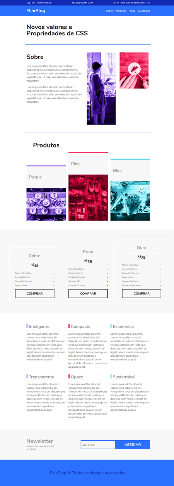

# Nome do produto
> Exemplo de site, criado utilizando puramente CSS Flexbox, de acordo com o curso da Origamid.

O projeto é uma página simples, similar à uma página institucional com arquivos estáticos, onde pude utilizar todas as features do CSS Flexbox.

